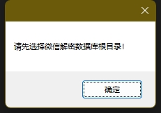
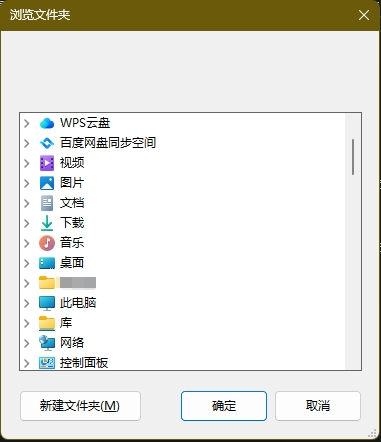
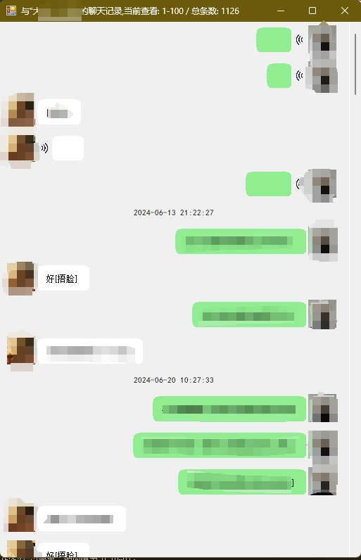
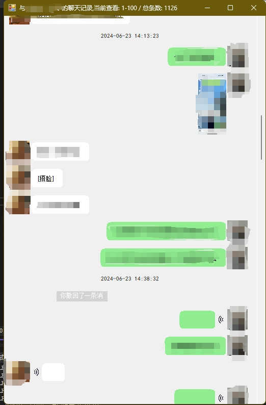
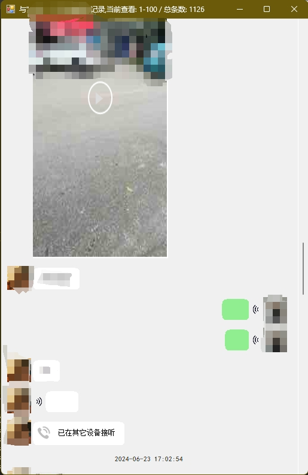
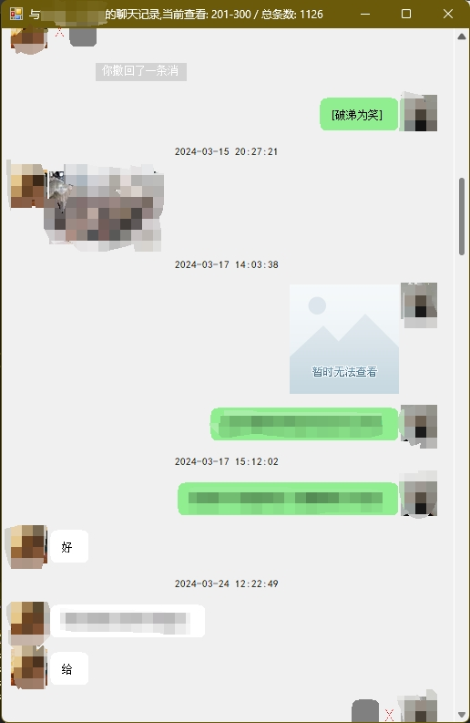
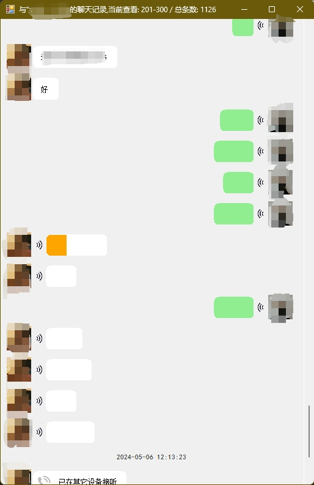

### 免责声明

#### 项目性质

本项目为开源软件，旨在提供免费的技术解决方案。使用本项目的用户应理解本项目的风险，并在此基础上使用。

#### 不提供担保

本项目不保证其功能、适用性、可靠性或安全性。所有软件都是按“现状”提供的，开发者不作任何形式的明示或暗示的担保。

#### 责任限制

在任何情况下，开发者不对因使用本项目而引起的任何直接、间接、附带、特殊或后果性损害承担责任，包括但不限于利润损失、数据损失或其他经济利益的损失。

#### 使用风险

用户使用本项目所带来的所有风险由用户自行承担。开发者不负责任何因使用本项目或依赖于项目内容而造成的损失或损害。

#### 遵守法律

用户在使用本项目时，需遵守适用法律法规。开发者不对用户的任何违规行为负责。

##### 简介：

该项目主要用于Windows PC微信解密数据库的展示，目前支持语音消息、文字消息、图片消息、视频消息、部分自定义表情，程序自带dat图片转换、头像下载、数据库合并、部分自定义表情下载等，
需要配合pywxdump使用，解密数据库为pywxdump解密出来的数据库，格式为de_XXX.db，目前仅支持查看聊天记录，后续会进一步完善，大佬勿喷！

*所有代码均为源代码，使用了部分lib需要自行下载，有需要的自行下载修改，程序还有许多bug，大佬勿喷*。

***

#### 使用方法：

> 1. 使用其他工具解密PC端数据库，例如pywxdump，解密得到以de_\***.db为名称的数据库文件；

> 2. 拷贝**微信安装目录下的**<`你的微信ID`>/*MsgAttach*（主要是存放**图片**）、*Video*（主要是**视频**）、*CustomEmotion*（部分**自定义表情**）等文件夹到解密后的数据库文件所在文件夹；

> 3. 下载release下的zip文件，解压到本地，至少安装.Net Framework 4.8

> 4. 双击wxreader.exe文件打开程序，提示选择数据库所在路径，之后逐一点击“合并数据”、“dat转换”、“语音解码”，“下载表情”、“下载头像”按钮  
每个按钮都有对应的进度条，所耗时间有可能很长，有可能很短，与总聊天记录数有关；  
	   

> 5. 一切准备好之后“`打开联系人列表`”会处于**可点击**状态，然后点击，这个也依赖于的联系人数量，可能很久也可能很快：  
>>	*上述几个按钮可能有的会报错，不过不要担心，关了重开几次就好了，基本资源处理完成之后打开就快了；*

> 6. 如果一切顺利你就可以顺利看到**联系人列表**，有三列，分别为“`昵称`、`备注`、`消息条数`”，包含联系人**头像**，已经自动***降序排序***，点击联系人**头像**即可打开消息记录浏览；  
	

> 7. 浏览消息时需要**手动拖动**滚动条，或者**鼠标滚轮**也行，默认加载*最新100条*消息，含`文字`、`语音`、`图片`、`视频`、`音视频通话`、`系统消息`，由于  
	所有内容均为手动绘制所以加载过程有点***慢***，滚动条拖到最上方**触顶**自动加载下100条消息，也可以点击滚动条上方的上**三角**自动加载，加载之后先前的消息显示会被  
	**删除**（仅**UI删除**，为了提高加载速度），语音可*点击*，点击后会播放语音消息并有*播放进度*显示。视频消息可点击并会**弹出播放窗口**（点击控制`播放/暂停`），图片点击之后会以*原始*  
	分辨率展示（图片有大小，有的图片有**高清**，有的只有*预览*）；
	    

> 8. 现以支持文本表情混编（emoji），以及部分Unicode表情。

> 9. 头像找不到的时候需要一个默认图片作为头像，使用你喜欢的图片并重命名为**default.jpg**，放到`headimage`目录下即可。

> 10. 历史消息界面支持使用快捷键G跳转到指定索引位置，不用再拖滚动条啦！
	
*注意：不含有表情的文本消息可以右键直接复制,表情图片不可点击，转换语音的时候存在多线程冲突，多开几次就好了，存在的不会转换*

#### 数据库及资源文件目录结构

	解密数据库根目录（de\_xxx.db)
	|
	|
	|---contract(语音文件)
	|      |
	|      |--[wxid]
	|            |
	|            |--silk(数据库提取的.silk文件)
	|            |
	|            |--mp3(程序转码之后的.mp3语音文件)
	|
	|
	|      
	|---headimage(头像，高/低清)
	|      |
	|      |--[wxid].jpg
	|
	|---MsgAttach
	|      |
	|      |--[md5]
	|           |
	|           |--Image(高清图)
	|	        |     |
	|           |     |--xxxx年-xx月
	|           |            |
	|           |            |--[md5].dat(加密图片)
	|           |            |
	|	        |            |--Decode(程序解密后的图片)
	|           |
	|           |--Thumb(模糊预览图)
	|                 |
	|                 |--xxxx年-xx月
	|                        |
	|                        |--[md5].dat(加密模糊图片)
	|                        |
	|                        |--Decode(程序解密后的图片)
	|
	|---Multi(其他数据库文件)
	|
	|
	|---Video(视频文件)
	       |
	       |--xxxx年-xx月
	             |
	             |---[md5].mp4(短视频)
	             |
	             |---[md5].jpg(视频预览图片)
	

#### 可执行文件目录结构

	net48
	|
	|
	|---emoji(qq表情组)
	|
	|
	|---FileIcon(文件类型图标，未使用)
	|
	|
	|---libvlc(VLC库)
	|
	|
	|---Resources(资源库，一些图标)
	|
	|
	|---silk-v3-decoder-master(silk解码库，含ffmpeg，结构勿动)
	|
	|
	|---wxemoji(黄豆文字表情，目前整理107个，似乎还差几个，png去背最小框，拿去用)
	|
	|
	|---x64(系统库，勿动)
	|
	|
	|---x86(系统库，勿动)
	|
	|
	|---[xxx].dll(动态库，勿删)
	|
	|
	|---wxreader.exe(主程序，双击即可运行)
	|
	|
	|---其他文件最好也别动，会造成程序不稳定

***Have fun!***

